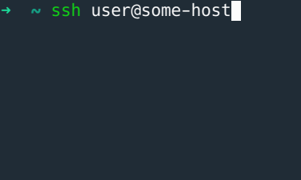
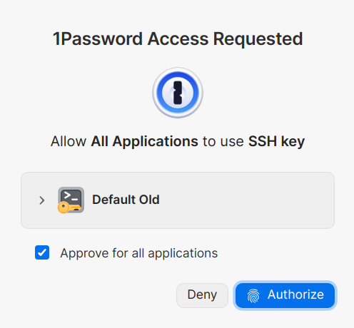
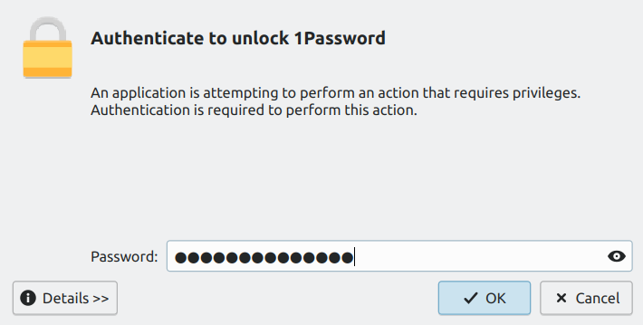

If you use [1Password's SSH Agent](https://developer.1password.com/docs/ssh/agent/) to manage access to a lot of SSH keys on GNU/Linux, then you probably go through this process multiple times a day:

1. Connecting to a host via SSH (when using `ssh` command, or `git`, etc.):
   
2. 1Password asking to authorize access:
   
3. Polkit prompting to unlock 1Password ([System authentication](https://support.1password.com/system-authentication-linux/)):
   

Visiting two different dialogs followed by entering a `l*************ng` password may not be the most fun experience you can get. So, how to make it better?

## Skip Polkit prompt by adding a rule

You can add a [Polkit authorization rule](https://www.freedesktop.org/software/polkit/docs/latest/polkit.8.html) to unlock 1Password without being asked for authentication. A Polkit rule is basically a JavaScript function that overrules the default settings.

These rules can be found in the following two places:

* `/usr/share/polkit-1/rules.d`: Used by packages to add their rules
* `/etc/polkit-1/rules.d`: Used for local configuration

So, we'll create a new file at `/etc/polkit-1/rules.d/00-1password-noauth.rules`. Then we add:

```javascript
polkit.addRule(function (action, subject) {
    if (
        (
            action.id == "com.1password.1Password.unlock" ||
            action.id == "com.1password.1Password.authorizeSshAgent"
        ) &&
        subject.isInGroup("wheel")
    ) {
        return polkit.Result.YES;
    }
});
```

There is no need to reboot system or restart any service after saving the rule file. Polkit will detect and apply changes immediately.

Here we check if the `action`'s `id` match the ones defined by 1Password. You can find these `id`s at `/usr/share/polkit-1/actions/com.1password.1Password.policy` installed by 1Password for use with system authentication. We also check if the user is in [wheel group](https://en.wikipedia.org/wiki/Wheel_(computing)).

You might ask why we name our rule file `00-1password-noauth.rules` and not `1password-noauth.rules`? Because the rules are read and processed by Polkit in a certain order and this is how it's determined. Rules with smaller numbers are processed first.

1Password makes it much easier and safer to keep and manage SSH keys. However, with some Linux setups such as mine, you'd have to enter system's password multiple times a day which is very annoying... and meaningless since the vault and the systems is already unlocked!
